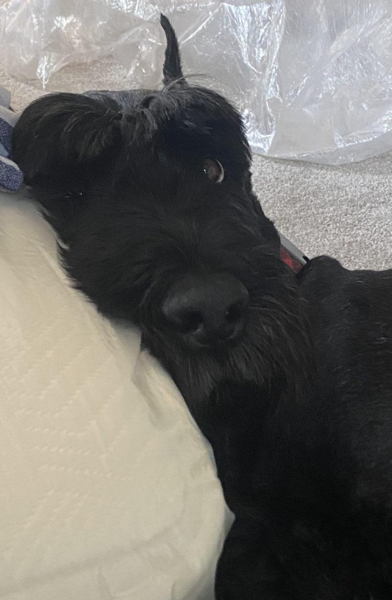

<h2 align="center">[ICCVW'25] <a href="https://arxiv.org/abs/2507.22576">COOkeD: Ensemble-based OOD detection<br/> in the era of zero-shot CLIP </a>
</h2>

  <p align="center">
    <br/>
     Galadrielle Humblot-Renaux, Gianni Franchi, Sergio Escalera, Thomas B. Moeslund
  </p>

<p align="center">

</p>


## 🔎 About

OOD detection methods typically revolve around a single classifier, leading to a split in the research field between the classical supervised setting (e.g. ResNet18 classifier trained on CIFAR100) vs. the zero-shot setting (class names fed as prompts to CLIP). 

Instead, COOkeD is a heterogeneous ensemble combining the predictions of a closed-world classifier trained end-to-end on a specific dataset, a zero-shot CLIP classifier, and a linear probe classifier trained on CLIP image features. While bulky at first sight, this approach is modular, post-hoc and leverages the availability of pre-trained VLMs, thus introduces little overhead compared to training a single standard classifier.

We evaluate COOkeD on popular CIFAR100 and ImageNet benchmarks, but also consider more challenging, realistic settings ranging from training-time label noise, to test-time covariate shift, to zero-shot shift which has been previously overlooked. Despite its simplicity, COOkeD achieves state-of-the-art performance and greater robustness compared to both classical and CLIP-based OOD detection methods.


## Demo

<details>
<summary>Code (see <code>demo.py</code>):</summary>

```python
from PIL import Image
import torch
from model_utils import get_classifier_model, get_clip_model, get_probe_model
from data_utils import preprocess_for_clip, preprocess_for_cls, get_label_to_class_mapping

# load trained models
device = "cuda" # or "cpu"
clip_variant = "ViT-B-16+openai" # or ViT-B-16+openai, ViT-L-14+openai, ViT-H-14+laion2b_s32b_b79k
classifier = get_classifier_model("imagenet","resnet18-ft", is_torchvision_ckpt=True, device=device)
probe = get_probe_model("imagenet", clip_variant, device=device)
clip, clip_tokenizer, clip_logit_scale = get_clip_model(clip_variant, device=device)

clip.eval() # pre-trained CLIP model from open_clip
probe.eval() # linear probe trained on CLIP image features from ID dataset
classifier.eval() # Resnet18 trained on ID dataset

# define ID classes and encode prompts
class_mapping = get_label_to_class_mapping("imagenet")
prompts = ["a photo of a [cls]".replace("[cls]",f"{class_mapping[idx]}") for idx in range(len(class_mapping))]
with torch.no_grad():
    prompt_features = clip.encode_text(clip_tokenizer(prompts).to(device))
    prompt_features_normed = prompt_features / prompt_features.norm(dim=-1, keepdim=True)

image_paths = [ # example images
    "illustrations/IMG_0409-768x1176.jpg", # schnautzer dog, ID
    "illustrations/greenland_shark.jpg" # greenland shark, OOD
]

ood_scoring = lambda softmax_probs: torch.distributions.Categorical(probs=softmax_probs).entropy().item() # entropy as OOD score
#ood_scoring = lambda softmax_probs: torch.max(softmax_probs, dim=1).values.item() # maximum softmax probability (MSP) as OOD score

for image_path in image_paths:
    print(f"---------------{image_path}-------------------")
    image = Image.open(image_path).convert("RGB")

    # note: different normalization for CLIP image encoder vs. standard classifier
    image_normalized_clip = preprocess_for_clip(image).to(device)
    image_normalized_cls = preprocess_for_cls(image).to(device)

    with torch.no_grad():
        # 1. get zero-shot CLIP prediction
        clip_image_features = clip.encode_image(image_normalized_clip)
        clip_image_features_normed = clip_image_features / clip_image_features.norm(dim=-1, keepdim=True)
        text_sim = (clip_image_features_normed @ prompt_features_normed.T)
        softmax_clip_t100 = (clip_logit_scale * text_sim).softmax(dim=1)

        # 2. get probe CLIP prediction
        softmax_probe = probe(clip_image_features).softmax(dim=1)

        # 3. get classifier prediction
        softmax_classifier = classifier(image_normalized_cls).softmax(dim=1)

    # 4. combined prediction
    softmax_ensemble = torch.stack([softmax_clip_t100, softmax_probe, softmax_classifier]).mean(0)

    # class prediction and OOD scores
    pred = softmax_ensemble.argmax(dim=1)
    ood_score = ood_scoring(softmax_ensemble)

    print("CLIP prediction:", class_mapping[softmax_clip_t100.argmax(dim=1).item()], f"(OOD score: {ood_scoring(softmax_clip_t100):.2f})")
    print("Probe prediction:", class_mapping[softmax_probe.argmax(dim=1).item()], f"(OOD score: {ood_scoring(softmax_probe):.2f})")
    print("Classifier prediction:", class_mapping[softmax_classifier.argmax(dim=1).item()], f"(OOD score: {ood_scoring(softmax_classifier):.2f})")
    print("---> COOkeD prediction:", class_mapping[pred.item()] , f"(OOD score: {ood_score:.2f})")
    
    print(f"--------------------------------------------------------------------------------------------------------------")
```
</details>

| ID image example | OOD image example |
|:---:|:---:|
| <p align="center">Schnauzeer dog</p> | <p align="center">Greenland shark</p> |
| CLIP prediction: Giant Schnauzer ✅ (OOD score: 2.01)<br>Probe prediction: Scottish Terrier ❌ (OOD score: 4.12)<br>Classifier prediction: Giant Schnauzer ✅ (OOD score: 0.54)<br>**COOkeD prediction: Giant Schnauzer ✅ (OOD score: 2.60)** | CLIP prediction: snoek fish (OOD score: 1.52 ❌)<br>Probe prediction: dugong (OOD score: 3.89 ❌)<br>Classifier prediction: eel (OOD score: 0.93 ✅)<br>**COOkeD prediction: eel (OOD score: 2.80 ✅)** |

## Getting started

### Set-up

This code was tested on Ubuntu 18.04 with Python 3.11.3 + PyTorch 2.5.1+cu121 + TorchVision 0.20.1+cu121

```bash
conda create --name cooked python=3.11.3
conda activate cooked
pip install torch==2.5.1 torchvision==0.20.1 --index-url https://download.pytorch.org/whl/cu121
pip install -r requirements.txt
```
### Download the datasets

Run the following script to download the ID datasets (ImageNet-1K, ImageNet-200, CIFAR100, DTD, PatternNet) and corresponding OOD datasets automatically:

``python3 data_download.py``

<details>
<summary>Expected directory structure:</summary>

```bash
data/
├── benchmark_imglist
│   ├── cifar100
│   ├── imagenet
│   ├── imagenet200
│   └── ooddb
├── images_classic
│   ├── cifar10
│   │   ├── test
│   │   └── train
│   ├── cifar100
│   │   ├── test
│   │   └── train
│   ├── mnist
│   │   ├── test
│   │   └── train
│   ├── places365
│   │   ├── airfield
│   │   ├── ...
│   │   └── zen_garden
│   ├── svhn
│   │   └── test
│   ├── texture
│   │   ├── banded
│   │   ├── ...
│   │   └── zigzagged
│   └── tin
│       ├── test
│       ├── train
│       ├── val
│       ├── wnids.txt
│       └── words.txt
└── images_largescale
    ├── DTD
    │   ├── images
    │   ├── imdb
    │   └── labels
    ├── imagenet_1k
    │   ├── train
    │   └── val
    ├── imagenet_c
    │   ├── brightness
    │   ├── ...
    │   └── zoom_blur
    ├── imagenet_r
    │   ├── n01443537
    │   ├── ...
    │   └── n12267677
    ├── imagenet_v2
    │   ├── 0
    │   ├── ...
    │   └── 999
    ├── inaturalist
    │   ├── images
    │   └── imglist.txt
    ├── ninco
    │   ├── amphiuma_means
    │   ├── ...
    │   └── windsor_chair
    ├── openimage_o
    │   └── images
    ├── PatternNet
    │   ├── images
    │   └── patternnet_description.pdf
    └── ssb_hard
        ├── n00470682
        ├── ...
        └── n13033134
```

</details>

### Download pre-trained classifiers

Classifier checkpoints will be downloaded automatically when you run the demo or eval scripts. For ImageNet1K, we use pre-trained classifiers from TorchVision (will be downloaded to ``checkpoints/torchvision``), and for the other ID datasets we share our own trained classifiers at https://huggingface.co/glhr/COOkeD-checkpoints (will be downloaded to ``checkpoints/classifiers``).


## Run experiments

The script ``eval.py`` evaluates COOkeD in terms of classification accuracy and OOD detection for a given ID dataset, classifier architecture and CLIP variant. Running the following should give you the same results as Table 3 in the paper:
```bash
classifier=resnet18-ft # or resnet50-ft
clip_variant=ViT-B-16+openai # or ViT-L-14+openai
python eval.py --id_name imagenet --classifier $classifier --clip_variant $clip_variant # standard evaluation on ImageNet-1K
python eval.py --id_name imagenet --classifier $classifier --clip_variant $clip_variant --csid # test-time covariate shift

python eval.py --id_name cifar100n_noisyfine --classifier $classifier --clip_variant $clip_variant # training-time label noise
python eval.py --id_name ooddb_dtd_0 --classifier $classifier --clip_variant $clip_variant # zero-shot shift (texture images as ID dataset)
```

Full results with both MSP and entropy as OOD score are saved as CSVs to the ``results`` directory. 


## 📚 Citation
If you use our work, please cite our paper:

```bibtex
@InProceedings{cooked_2025,
    author    = {Humblot-Renaux, Galadrielle and Franchi, Gianni and Escalera, Sergio and Moeslund, Thomas B.},
    title     = {{COOkeD}: Ensemble-based {OOD} detection in the era of {CLIP}},
    booktitle = {Proceedings of the IEEE/CVF International Conference on Computer Vision (ICCV) Workshops},
    year      = {2025}
}
```

## ✉️ Contact

If you have have any issues or doubts about the code, please create a Github issue. Otherwise, you can contact me at gegeh@create.aau.dk

## Acknowledgements

The codebase structure and dataset splits for ImageNet and CIFAR100 are based on [OpenOOD](https://github.com/Jingkang50/OpenOOD). We also use data splits from [OODDB](https://ooddb.github.io).
We use [open_clip](https://github.com/mlfoundations/open_clip) to load pre-trained CLIP models.
